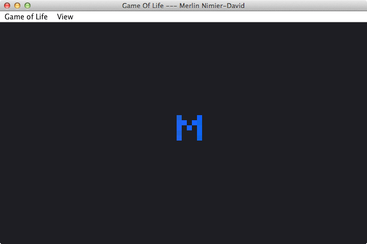
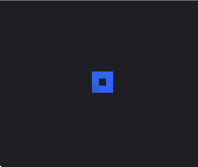
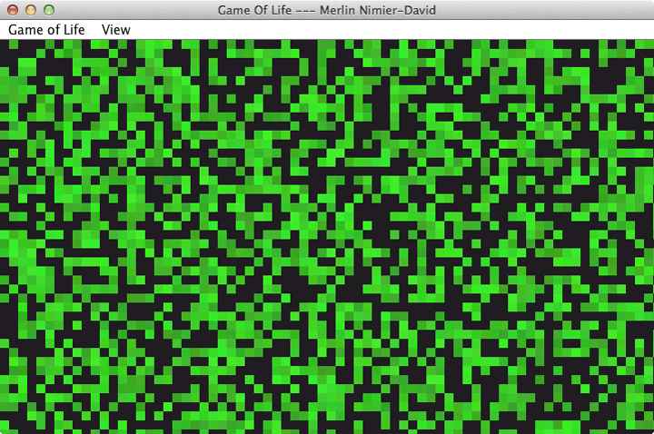
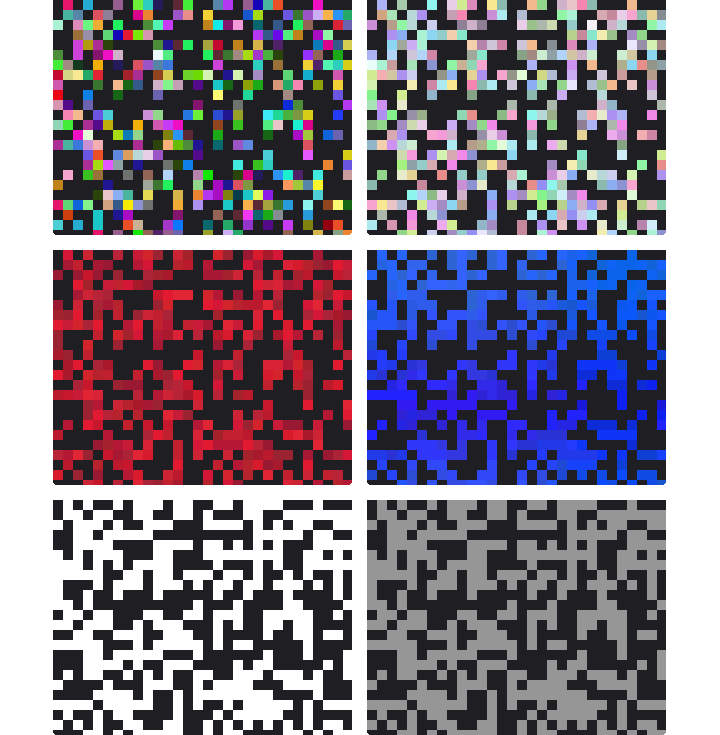
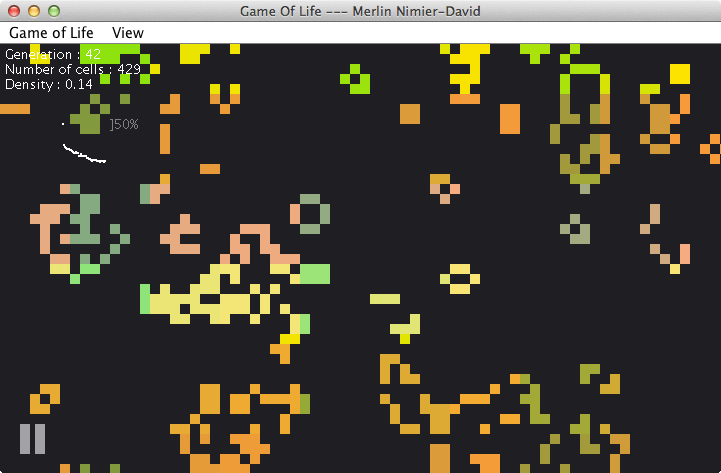
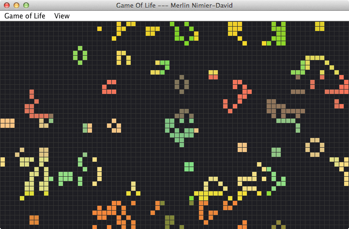
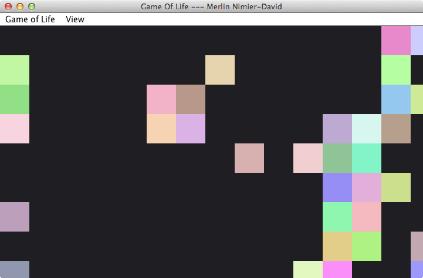

# Game of Life
Conway's famous game of life is based on four simple rules:
1. Any live cell with fewer than two live neighbours dies, as if caused by under-population.
1. Any live cell with two or three live neighbours lives on to the next generation.
1. Any live cell with more than three live neighbours dies, as if by overcrowding.
1. Any dead cell with exactly three live neighbours becomes a live cell, as if by reproduction.

This is a nice looking Java implementation.
*Note*: This code was written a long time ago and it was one of my first Java projects. Please excuse the inevitable quirks, and the comments in French.

# Usage
## Draw and play
Just run the .jar to open a canvas.

You can draw new cells with the `left click` and kill live cells with the `right click`.
To run the game, press the `spacebar`. Time will start passing. 

To adjust speed, use the up and down keyboard arrows.
Alternatively, when the game is paused you can go generation by generation (one frame at a time) by using the  `right` keyboard arrow.
At any time, go full screen with the `f` key. 

## Canvas initialization
The canvas can be automatically filled in three different ways:
1. Press `e` to empty the canvas. It will let a lot of free space for you to draw in.
1. Press `???` to fill the canvas fully. You can then start "drawing" by killing the cells you don't need. Note that if you just let the canvas completely full, all cells will die of overpopulation at the next generation.
1. Press `r` to fill the canvas randomly. This usually gives interesting results!

# Color schemes
Different color schemes are available, most of which have random and/or dynamic aspects. You can go through the different color schemes with the `mouse scroll` or by selecting one directly in the menu.

# Other features
## Statistics
Press `s` to display the following statistics about the current world:
- Generation number
- Number of live cells
- Density (i.e. alive cells over total world size)

A graph of the cell density over time is also showed, with one data point for each generation.

## Grid
Press `g` to display a grid overlay.

## Customize cell size
You can choose a larger or smaller cell display size in the View menu.
